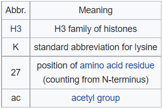

# Проект по майнору Биоинформатика, ВШЭ 2021

### О проекте

 Целью работы над проектом является поиск и изучение участков генома, где определенная гистоновая метка присутствует в местах образования вторичной структуры ДНК.
> - **Организм:** human
> - **Сборка генома:** hg19
> - **Структура:** ZDNA
> - **Метка:** H3K27ac
> - **Типы клеток:** A549, H9


### Список участников

|Имя участник | Группа | Тип клеток | Личный репозиторий |
|--|--|--|--|
| Зялалетдинова Камилла | 3 | А549 | [https://github.com/KamillaZyal/hse21_H3K27ac_ZDNA_human](https://github.com/KamillaZyal/hse21_H3K27ac_ZDNA_human) |
| Никитенко Яна | 3 | H9 | [https://github.com/nikyavn/hse21_H3K27ac_ZDNA_human](https://github.com/nikyavn/hse21_H3K27ac_ZDNA_human) |


## Отчёт

### Введение


**H3K27ac** - эпигенетическая модификация упаковочного белка ДНК гистона **H3** . Это знак указывает на ацетилирование лизина 27 на субъединице белка гистона H3. Гистон H3K4me1 и H3K27ac представляют собой модификации, специфичные для энхансеров, и необходимы энхансерам для активации транскрипции генов-мишеней. 

> **H3K27ac** связан с  высокой активацией транскрипции и поэтому определяется как активная энхансерная метка. H3K27ac обнаруживается как в проксимальных, так и в дистальных областях сайта начала транскрипции (TSS).
H3K27ac обогащены регуляторными областями генов, участвующих в болезни Альцгеймера , в том числе генов тау-белка и амилоидной невропатологии.

**Z-ДНК** - одна из многих возможных двойных спиральных структур ДНК . Это левосторонняя двойная спиральная структура, в которой спираль закручивается зигзагообразно влево, а не вправо, как в более распространенной форме B-ДНК . Z-ДНК считается одной из трех биологически активных двойных спиральных структур наряду с A-ДНК и B-ДНК. 


### Обзор исходных файлов

| Участник | Организм | Тип клетки | Эксперимент 1 | Эксперимент 2 |Эксперименты определения вторичной стр-ры ДНК |
|--|:--:|:--:|:--:|:--:|:--:|
| Зялалетдинова Камилла | human | А549 | ENCFF389RXK | ENCFF926NKP | ZDNA_DeepZ  |
| Никитенко Яна | human | H9 | ENCFF997MGG | ENCFF365GJO | ZDNA_DeepZ  |

Клетки **А549** являются аденокорциномой альвеолярных эпителиальных клеток , и представляют собой клеточную линию , которая была впервые разработана в 1972 году DJ Giard и др. путем удаления и культивирования раковой легочной ткани в эксплантированной опухоли 58-летнего мужчины европеоидной расы. Клетки используются в качестве моделей для изучения рака легких и разработки лекарств против него. 

Клон **H9** был ассоциирован со способностью к репликации ВИЧ-1 и использовался для выделения и размножения ВИЧ-1 из крови пациентов с синдромом приобретенного иммунодефицита (СПИД) и состояниями, предшествующими СПИДу. Категория - Эмбриональные стволовые клетки. 

Подход машинного обучения DeepZ, который объединяет информацию из полногеномных карт эпигенетических маркеров, факторы транскрипции и сайты связывания РНК-полимеразы, а также карты доступности хромосом. С помощью разработанной модели не только проверяются экспериментальные предсказания Z-ДНК, но и генерируется аннотация всего генома, вводя новые возможные области Z-ДНК, которые еще не были обнаружены в экспериментах 

### Длины пиков по эксперементам
#### Статистика
###### ***Количнство пиков для разных версий генома***
| | ENCFF926NKP - А549 | ENCFF389RXK - А549 | ENCFF997MGG - H9 | ENCFF365GJO - H9 |
|----------------|:---------:|:---------:|:---------:|:---------:|
| Для версии генома ***hg38*** | 118990 | 116220 | 268678 | 227245 |
| Для версии генома ***hg19*** | 118767 | 115997 | 268254 | 226956 |
| Для ***filter_peaks*** hg19 | 115115 | 112077 | 268211 | 226934 |
| Для **DeepZ** | 19394 |19394|19394|19394|
| Пересечение с **DeepZ** | 13121 | 13121 | 8431 | 8431 |


***Гистограмма длин участков A549***
 
 ***Гистограмма длин участков H9***
 
#### ***Круговая диаграмма ChIPseeker A549***

#### ***Круговая диаграмма ChIPseeker H9***


### Анализ пиков, полученных после тотального пересечения
Описанные выше два файла были пересечены (bedtools intersect), а результат был проверен на наличие дупликатов (объединен bedtools merge).

- Строим гистограмму длин участков:

 #### ***Гистограмма длин участков***
 
 **После пересечения:** 7340
- Анализируем, где эти пики находятся относительно аннотированных генов:

#### ***Круговая диаграмма ChIPseeker***

### Визуализация данных в геномном браузере
- Визуализируем в UCSC Genome Browser все исходные .bed файлы,набор участков, полученный после их тотального пересечения:
    - Добавим сustom Tracks командами (аналогично другие файлы):
    ```  
     track visibility=dense name="H3K27ac_ZDNA_merge"  color=200,0,0 description="H3K27ac_ZDNA_merge_hg19"
     https://raw.githubusercontent.com/KamillaZyal/hse21_H3K27ac_ZDNA_human_group/main/data/H3K27ac_ZDNA.merge.hg19.bed

     track visibility=dense name="H3K27ac_A549_intersect_with_DeepZ"  description="H3K27ac_A549_intersect_with_DeepZ.bed"
     https://raw.githubusercontent.com/KamillaZyal/hse21_H3K27ac_ZDNA_human_group/main/data/H3K27ac_A549_intersect_with_DeepZ.bed

     track visibility=dense name="H3K27ac_H9_intersect_with_DeepZ"  description="H3K27ac_H9_intersect_with_DeepZ.bed"
     https://raw.githubusercontent.com/KamillaZyal/hse21_H3K27ac_ZDNA_human_group/main/data/H3K27ac_H9_intersect_with_DeepZ.bed
    ```
    
    - Ссылка на визуализированные данные:
    ```
     http://genome.ucsc.edu/s/nikyavn/H3K27ac_ZDNA
    ```
- Найдем места в геноме, где имеется тотальное пересечение всех пиков:
   ### **Координаты chr3:119,180,163-119,185,434**
    
   ### **Координаты chr10:75,543,726-75,547,346**
    
   ### **Координаты chr20:44,562,573-44,564,408**
    
   ### **Координаты chr19:12,847,991-12,848,721**
   
### Ассоциация пиков тотального пересечения с генами и делаем GO анализ
- Было ассоциировано 6478 пиков 
- [Список ассоциированных генов](https://github.com/KamillaZyal/hse21_H3K27ac_ZDNA_human_group/blob/main/data/H3K27ac_ZDNA_merge_hg19_genes.txt)
- [Список уникальных генов](https://github.com/KamillaZyal/hse21_H3K27ac_ZDNA_human_group/blob/main/data/H3K27ac_ZDNA_merge_hg19_genes_uniq.txt)

- Результат GO-анализа:
  
- Наиболее значимыми категориями оказались различные основные метаболические процессы, но также присутствуют значимые категории, связанные с восприятием и запахом:
   

## Выводы

- Большая часть пиков расположена на промоторах, что подтверждает функцию гистонной метки, а также особенности метода DeepZ 
- Наблюдается соответствие между между исследуемой меткой и ZDNA
- Пропорция числа пиков и их расположение до\после пересечения очень схожа
